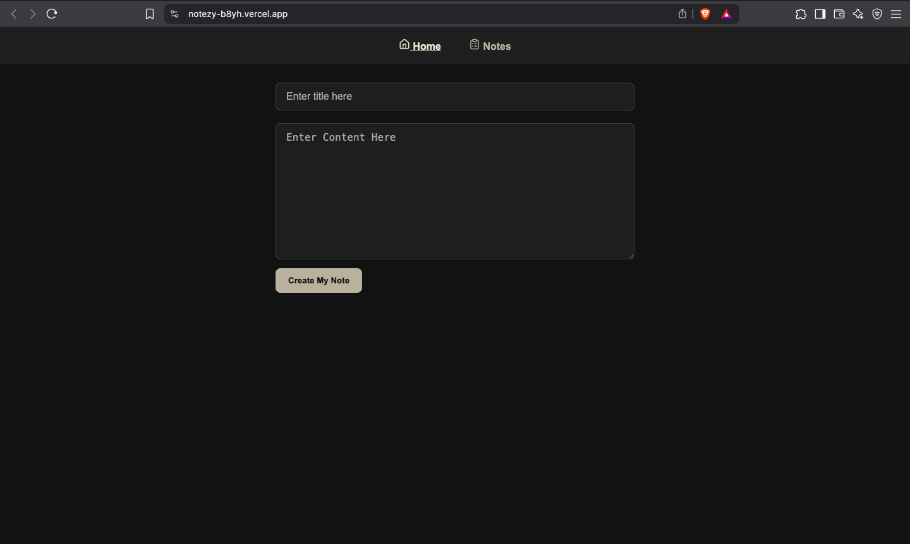
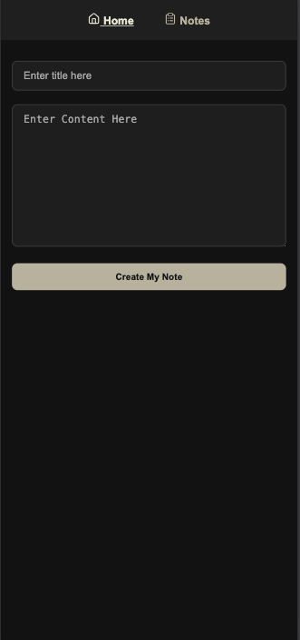

# 📝 Notezy – A Simple, Fast & Stylish Note-Taking App

> Built with 💙 React, Redux Toolkit, and Vite  
> A clean and elegant application to write, manage, and preview notes seamlessly.

---

🔗 **Live Demo**: [notezy.vercel.app](notezy-b8yh.vercel.app)  
📦 **GitHub Repo**: [github.com/Jemis-Tejani/notezy](https://github.com/Jemis-Tejani/notezy.git)

---

## 🚀 Features

- ✅ **Create, Edit & Delete Notes** – Keep your ideas organized in seconds.
- 🔎 **Live Preview** – Instantly see your note formatting before saving.
- 🕵️ **Empty State UI** – Clear message when no notes are present.
- 🧠 **Redux Toolkit Integration** – Centralized state management.
- 🌓 **Sticky Header** – Navigation always visible on scroll.
- ⏰ **Formatted Date & Time** – Human-readable time on every note.
- 📜 **Syntax Highlighting Ready** – (Future scope: Code block support)
- 💾 **Persistent Storage** – Saves notes locally using `localStorage`.
- 🚀 **Fast Build with Vite** – Lightning-fast performance for modern browsers.
- ✅ **100% Responsive** – Looks great on all devices.
- 🧹 **Clean UI & UX** – Intuitive and minimal design.

---

## 📂 Folder Structure

```bash
notezy/
│
├── src/
│   ├── components/
│   │   ├── Home.jsx
│   │   ├── Layout.jsx
│   │   ├── Note.jsx
│   │   ├── ViewNote.jsx
│   │   ├── ViewNote.css
│   │   └── Navbar.jsx
│   │
│   ├── redux/
│   │   └── noteSlice.jsx
│   │
│   ├── Store.jsx
│   ├── App.jsx
│   ├── main.jsx
│   └── App.css
│
├── .gitignore
├── index.html
├── package.json
└── README.md
```

---

## 🖥️ Screenshots

| 💻 Desktop View                     | 📱 Mobile View                    |
| ----------------------------------- | --------------------------------- |
|  |  |

---

## 🛠️ Tech Stack

| Tech                | Purpose                     |
| ------------------- | --------------------------- |
| ⚛️ React            | UI Development              |
| 📦 Redux Toolkit    | State Management            |
| 🚦 React Router DOM | Routing between pages       |
| 🛠️ Vite             | Build Tool for speed        |
| 🖼️ CSS              | Styling & Responsive Layout |
| 🔔 React Hot Toast  | Notifications               |
| 💾 localStorage     | Data Persistence            |

---

## 🚀 How to Run Locally

1. **Clone the repository**

   - git clone https://github.com/Jemis-Tejani/notezy.git
   - cd notezy

2. **Install dependencies**

   - npm install

3. **Start the development server**

   - npm run dev

4. **Open http://localhost:5173 in your browser**

---

## 🧠 What I Learned

- React project structure using Vite + Redux Toolkit
- Managing localStorage with Redux for persistent data
- Creating reusable components in a modular structure
- Enhancing UX with empty states, formatted timestamps, and dynamic preview
- Responsive layout and sticky header using plain CSS
- Deploying and auto-updating apps via GitHub + Vercel

---

## 📄 License

This project is open-source and available under the [MIT License](LICENSE).

---

## 📬 Contact Me

Feel free to reach out to me for freelance work, collaboration, or project inquiries:

- 📧 **Email:** [tejanijemis@gmail.com](mailto:tejanijemis@gmail.com)
- 🌐 **Portfolio:** [jemis-tejani.github.io](https://jemis-tejani.github.io/)
- 💼 **LinkedIn:** [linkedin.com/in/jemish-tejani-031154236](https://linkedin.com/in/jemish-tejani-031154236)

---

## ⭐ Show Your Support

If you like this project or found it useful:

- ⭐ Give it a **Star** on GitHub
- 🔄 **Fork** it and modify for your own use
- 📣 **Share** it with your network

---
